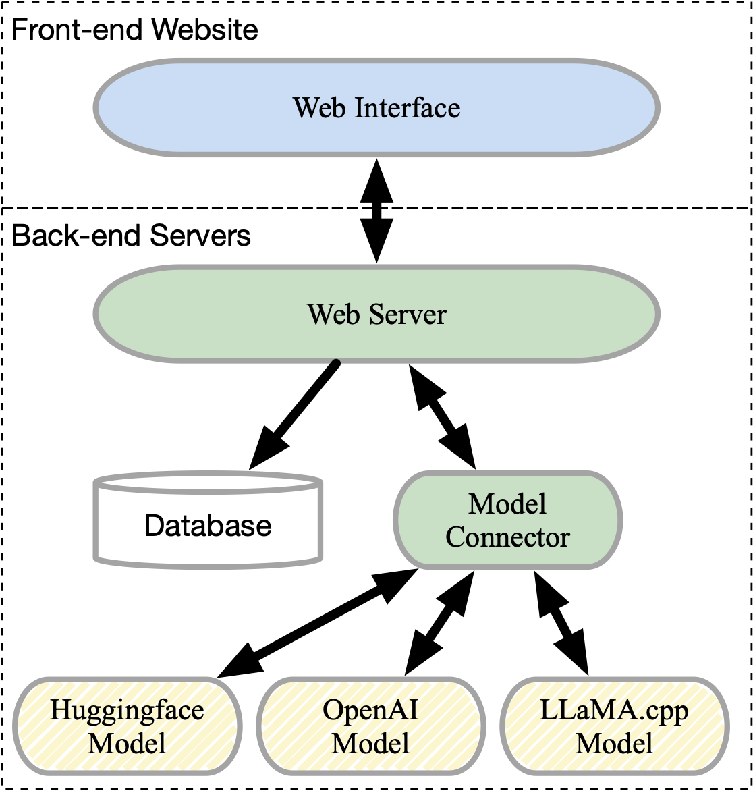

# Deployment of the Human Evaluation Tool with Docker-compose

The `deployment` directory is dedicated to facilitating the *one-click* deployment of our human evaluation tool using Docker-compose. This directory includes all the necessary scripts and configuration files to ensure an automated deployment process.

## Contents of the Directory

- **YAML Files for Docker-compose**: These files are used to configure and orchestrate the deployment of the tool's various components through Docker-compose.
- **`.env` Environment File**: Contains essential environment variables and configurations for deployment. This file should be modified to ensure that all components are correctly set up.
- **`nginx` Directory**: Houses the configuration files for our web server. Files in this directory should be modified for your own deployment.

## How to Use

The server architecture is segmented into five distinct parts, as illustrated in the figure below. This setup includes:

1. **Front-end Web Interface**: Accessible [here](../human_eval_tool/client).
2. **Web Server**: Accessible [here](../human_eval_tool/server).
3. **Database**: Utilises MongoDB. 
4. **Model Connector**: Utilises Redis middleware.
5. **ToD System Model Servers**: Described [here](../tod_system/human_eval_service), marked as dashed yellow rounded rectangles in the figure.


<p float="right">
  
</p>


### Components and Environment Setup

To successfully set up the evaluation tool, deployment of three types of servers is necessary:

1) **Model Connector**
2) **ToD System Model Servers**
3) **Web Servers**

For optimal reliability, deploying the Model Connector and Web Servers using Docker containers is recommended. Command-line methods are suggested for setting up the ToD System Model Servers.


### Container Fast Deployment with Docker

#### Model Connector


The **Celery Queue** functions as the model connector, handling the messaging process between the web interface and specific models. Celery requires **Redis** as a middleware for task distribution and result reception. To build the infrastructure, you need firstly deploy redis on one of your machines.


1. On your chosen machine for deploying Redis, clone the project and navigate to the `deployment` folder. Edit the **`.env`** file in this folder, setting the `REDIS_PASSWORD` and `REDIS_ADDRESS`. The `REDIS_ADDRESS` should be the IP address where the Redis service will be deployed.


2. Deploy the Redis service with the following command in the deployment folder:
     ```
     bash deploy.sh --component=redis
     ```
   > **Note**: We assume Redis will run on the default port (6379). If you have an existing Redis server on this port, it can be used directly. Alternatively, follow the provided instructions to deploy a new Redis instance.

   
#### ToD System Model Servers


The ToD System Model Servers are the pivotal components of our tool, responsible for processing task-specific requests within a dialogue system.

1. **Model Preparation**:
   - Before deploying these servers, it's essential to prepare your models for the ToD system. For demonstration, We offer two pretrained mt5 models for deployment testing purposes: `songbo/multi3woz-en-dst-mt5-small` and `songbo/multi3woz-en-rg-mt5-small`. These models are provided to verify the deployment process. 
   - If you're interested in training custom models for your ToD system, comprehensive guidance for training and preparing your models is available at [tod_system/README.md](../tod_system/README.md).
   
2. **Setup Variables and Configurations for Microservice Deployment**:
   - **Environment Setup**: Configure the **`.env`** file in the deployment folder as per the provided instructions.
   - **Model Configuration**: Create and modify the config file in [tod_system/human_eval_service/config](../tod_system/human_eval_service/config) with your model name and other paths. Example configurations like mt5.cfg are provided.

3. **Deployment Command**:

   - **Deployment Options** By default, this human evaluation tool follow the microservice architecture. It means that a system is are composed with two independent servers: **dst** and **rg**. You have to deploy them independently. To make our tool capable with other systems developed outside our toolkit, we provide another deployment option **e2e**. To connect the tool with your own system, your system have to implement this specified interface [tod_system/human_eval_service/your_own_cool_e2e_system.py](../tod_system/human_eval_service/your_own_cool_e2e_system.py).
   
   - **Example Command**:
     ```
     bash deploy.sh --component tod --env prod --name mt5 --type dst
     ```

     - **Command Components**:
       - `-c/--component`: Specifies the deployment component, e.g., `tod` for ToD system microservice.
       - `-e/--env`: Sets the environment, either 'dev' (which will be introduced later on) for development or 'prod' for production. Use `prod` here.
       - `-n/--name`: Indicates the model name. It will be used as MODEL_NAME variable in the **`.env`** file. This name should match your config file in [tod_system/human_eval_service/config](../tod_system/human_eval_service/config). mt5 is the model name in this example.
       - `-t/--type`: Denotes the model type (e.g., `dst`, `rg`, or `e2e`). This value will set up the MODEL_TYPE variable 

    
   - **Example Setup**:   For our testing setup, it is necessary to deploy both a DST model and an RG model. This can be accomplished by running the following commands:
 
     ```
     bash deploy.sh --component tod --env prod --name mt5 --type dst
     bash deploy.sh --component tod --env prod --name mt5 --type rg
     ```


> **GPU Support**: If deploying on an NVIDIA GPU server, modify [deployment/docker-compose_tod_prod.yml](docker-compose_tod_prod.yml) as per the Docker documentation on [GPU support](https://docs.docker.com/compose/gpu-support/).
> If you are using a server with **NVIDIA** GPUs, you may add the following lines to the **deployment/docker-compose_tod_prod.yml** below the volume section (ensure to keep the indent and start at the same indentation level as the `volume`):

```yaml
deploy:
   resources:
      reservations:
          devices:
           - driver: nvidia
             #count: the number of gpu you want to use
             capabilities: [gpu]
```


#### Front-end Web Interface and Web Server

1. **Initial Setup**:
   - Clone this repository on the machine intended for deployment.
   - Modify the **`.env`** file in this directory according to the instructions within.
   - For MongoDB setup, either:
     - Configure your own MongoDB instance on a cloud service and enter the MongoDB URL into the **`.env`** file.
     - To deploy MongoDB on your server, execute:
       ```
       bash deploy.sh --component mongodb
       ```

2. **Configure the Web Interface**:
   - In the **`.env`** file, set `REACT_APP_SERVER_URL` to your domain name or the IP address of the deployment machine.
   - If `USE_SSL` is set to true, and you have an SSL certificate, you can access your page via HTTPS.

3. **Modify Environment Variables**:
   - `SECRET_KEY`: Used for JWT token encryption.
   - `MONGO_URI`: The URI of your MongoDB database.
   - `TASK_PATH`: Represents the task for testers, defined in **human_eval_tool/server/config**. Follow the format in [human_eval_tool/server/config/test_goals.json](../human_eval_tool/server/config/test_goals.json).
   - For SSL: Place your certificate (`ssl.crt` and `ssl.key`) in **deployment/nginx/ssl**. Set `USE_SSL` to true and rename **example.ssl.conf** to **ssl.conf** in this folder.
   - `REACT_APP_SERVER_URL`: Should be your server IP or domain address if using an SSL certificate.

4. **Deploying the Human Evaluation Tool**:
   - Deploy with the command:
     ```
     bash deploy.sh --env=prod --component=tools --name {Your model name here}
     ```
   - In the above example, `Your model name here` is `mt5`.
     

5. **Container Verification**:
   - Use `docker ps` to check the containers. Ensure that server, nginx, and client containers are running. The client container will disappear once compiling is finished.

Once deployed, access the tool via the specified IP or domain name and enjoy its functionality. 🚀

> **Quick Test Example**:
> 
> We provide an example deployment at **www.dialeval.online**.
> 
> For a quick test with our provided mt5 model, ensure your machine meets the minimum requirements (8GB RAM, 4-core x86 server with Docker and Docker Compose). Set `MONGO_URI`(if you deploy mongodb with this tutorial, you don't need to change this), `ADMIN_EMAIL`, and `REACT_APP_SERVER_URL` (your machine IP address or domain name). Then execute the following deployment commands sequentially:
>```
>bash deploy.sh --component=redis
>```
>If you want to deploy the mongodb by yourself, then
>```
>bash deploy.sh --component=mongodb
>```
>Otherwise, you could use cloud mongo service with given `MONGO_URI`. Then,
> ```
> bash deploy.sh --env=prod --component=tools --name mt5
> bash deploy.sh --component tod --env prod --name mt5 --type rg
> bash deploy.sh --component tod --env prod --name mt5 --type dst
> ```


### Environment Setup for Command-line Deployment and Development

If you prefer to deploy this tool without Docker, or if you plan to modify the tool further, you will need to set up the development environment as follows:


#### Model Connector for Command-line

1. **Redis Service Setup**:
   - Clone the project on the deployment machine and navigate to the project folder.
   - Modify the **`.env`** file in the docker folder as per the instructions provided. As a first step, you only need to set the `REDIS_PASSWORD`.

2. **Deploying Redis**:
   - Use the following command in the project repository to deploy the Redis service:
     ```
     bash deploy.sh --component=redis
     ```
     


#### Front-end Web Interface and Web Server

For production environments, we highly recommend deploying this component using a Docker container. We have not provided a specific command-line method for production deployment. For detailed insights into this complicated process, please refer to our Docker file. For development purposes, you can follow these steps:

1. **Web Interface Setup**:
   - Clone this repository on the machine where you plan to deploy the human evaluation tools.
   - Modify the **`.env`** file in this directory according to the provided instructions.

2. **Deploying the Human Evaluation Tool**:
   - Deploy the tool with the following command:
     ```
     bash deploy.sh --env=dev --component=tools --name {Your model name}
     ```
   - Once completed, visit the human_eval_tool folder and follow the development instructions there.
     - [Dialogue System Human Evaluation Tool](../human_eval_tool/README.md#development-without-docker)

This setup allows you to test the web interface without encountering CORS issues. 😊

#### ToD System Model Servers

For developing and deploying your own ToD system models, we recommend using the command-line method, especially for production environments. Due to potential issues with CUDA in Docker, a command-line setup might be more reliable.

- **Development and Evaluation**:
  - Configure the **`.env`** file in this folder and follow the instructions provided in the [Multilingual E2E ToD System Development and Evaluation](../tod_system/README.md#setting-up-microservices-for-human-evaluation-without-docker) guide.

---
